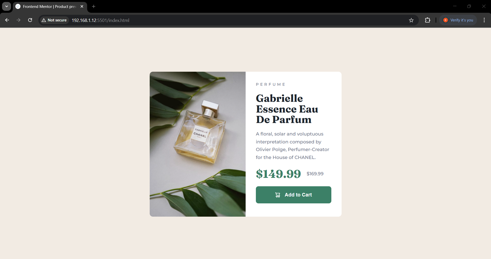
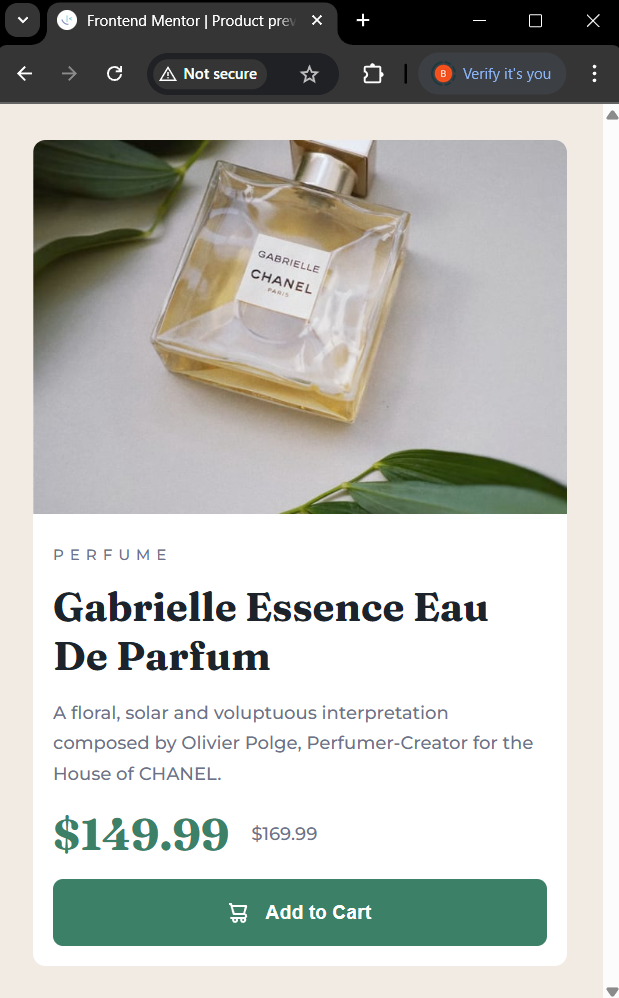

# Frontend Mentor - Product preview card component solution

This is a solution to the [Product preview card component challenge on Frontend Mentor](https://www.frontendmentor.io/challenges/product-preview-card-component-GO7UmttRfa). Frontend Mentor challenges help you improve your coding skills by building realistic projects. 

## Table of contents

- [Overview](#overview)
  - [The challenge](#the-challenge)
  - [Screenshot](#screenshot)
  - [Links](#links)
- [My process](#my-process)
  - [Built with](#built-with)
  - [What I learned](#what-i-learned)
  - [Continued development](#continued-development)
  - [Useful resources](#useful-resources)
- [Author](#author)
- [Acknowledgments](#acknowledgments)

## Overview

### The challenge

Users should be able to:

- View the optimal layout depending on their device's screen size
- See hover and focus states for interactive elements

### Screenshot

### Links

- Solution URL: [Github - product-previewe](https://github.com/bjax20/product-preview)
- Live Site URL: [Vercel - Product Preview](https://product-preview-five-psi.vercel.app/)

## My process

### Built with

- Semantic HTML5 markup
- CSS custom properties
- Flexbox
- Vanilla CSS

### What I learned

- Responsive layouts using Flexbox

- Writing reusable and scalable CSS with custom properties

- Handling images with <picture> and media queries

- Typography and spacing to match a pixel-perfect design

### 🧱 Layout & Structure
I learned how to build responsive layouts using Flexbox.

I was initially unsure whether to use a div or main as the card container. I ended up using a main element with a class of card, since it's the main content of the page — which makes sense semantically.

### 🎨 Styling & Sizing
I practiced writing reusable and scalable CSS using custom properties (--variables).

I learned that if I don't assign an explicit width/height to the card, and instead apply padding (like 1.8rem) on the body, the card automatically adjusts to the screen size — which is useful for mobile-first design.

I used min-height: 100vh on the body to ensure it fills the screen, and realized that without it, the body only expands based on content height. This helped clarify my confusion about width, height, and how the body behaves by default.

I also practiced pixel-perfect design using a browser extension, which helped me match the design spacing, font sizes, and layout more accurately.

### 📱 Responsive Images
I discovered and used the HTML <picture> element, which allows me to load different images depending on screen size.

I realized (later in the process) that the design provided different product images for desktop and mobile, and <picture> was the right tool to handle this responsively.

### 🖥️ Media Queries & Mobile-First Workflow
I applied media queries to change the layout at a specific breakpoint (600px for desktop).

I followed a mobile-first approach, meaning I wrote the default styles for small screens first, then overrode them for larger screens — which is a best practice for modern responsive design.

### Continued development

- max-width still confuses me. I think I need to refresh my understanding of how it works.

- I need to practice designing for mobile first and thinking about what needs to change for the desktop view.

## Author

- Website - [Bill Jerson](https://www.your-site.com)
- Frontend Mentor - [@bjax20](https://www.frontendmentor.io/profile/bjax20)

## Acknowledgments

When I got stuck, I used tools like ChatGPT to help me figure out how to approach the design. However, to make sure I wasn’t just copying and pasting the code and calling it a day, I inspected the design multiple times and retyped it gradually to observe the step-by-step progress. I removed some attributes that didn’t contribute to the final design and could be omitted. I literally retyped the code more than three times and was eventually able to build it from scratch. I even recorded myself teaching the process to reinforce my learning.